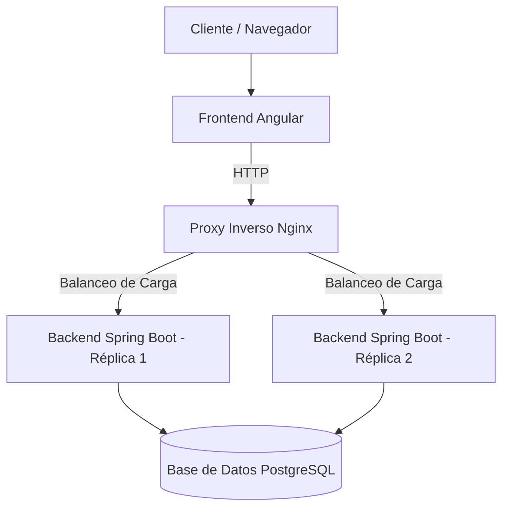

# Credit Card Validator

[](https://angular.io/)
[](https://spring.io/projects/spring-boot)
[](https://www.postgresql.org/)
[](https://www.docker.com/)
[](https://nginx.org/)

Una aplicación robusta y escalable diseñada para la validación y gestión de tarjetas de crédito, construida sobre una arquitectura de microservicios con balanceo de carga y contenedorización integral.

---

## Arquitectura del Sistema

El proyecto implementa un proxy inverso y balanceador de carga que distribuye el tráfico entre múltiples instancias del backend para garantizar alta disponibilidad.



## Tecnologías Utilizadas

* **Frontend:** Angular con TypeScript y estilos modernos.
* **Backend:** Spring Boot (Java) con arquitectura RESTful.
* **Base de Datos:** PostgreSQL para persistencia de datos relacionales.
* **Infraestructura:** Docker y Docker Compose para la orquestación de contenedores.
* **Servidor Web / Proxy:** Nginx configurado para balanceo de carga (*Load Balancing*) entre las réplicas del backend.


## Despliegue y Ejecución

### Requisitos Previos

Asegúrate de tener instalados los siguientes componentes en tu sistema:
* **Docker**
* **Docker Compose**

### 1. Configuración del Entorno

Clona este repositorio y crea un archivo llamado `.env` en la raíz del proyecto con las siguientes variables de entorno:

```env
# Configuración de la Base de Datos
DB_NAME=credit_card_validator
DB_USER=postgres
DB_PASSWORD=password
DB_URL=jdbc:postgresql://postgres:5432/credit_card_validator
```
### 2. Construcción y Arranque

Ejecuta el siguiente comando en tu terminal para compilar las imágenes e iniciar todos los servicios (Frontend, Réplicas del Backend, Base de Datos y Nginx) en segundo plano:

```
docker compose up --build -d
```
### 3. Acceso a la Aplicación

Una vez que todos los contenedores estén en estado Running, puedes acceder a la interfaz web abriendo tu navegador e ingresando a:

```
http://IP_SERVIDOR
```

